# Pollution-Causal-Inference

This project investigates **causal relationships** between air pollutants and environmental conditions using the [UCI Air Quality dataset](https://archive.ics.uci.edu/ml/datasets/Air+Quality). Specifically, we focus on **estimating the causal effect of NO₂ on Relative Humidity (RH)** using the [DoWhy](https://github.com/py-why/dowhy) library.

---

## Dataset

- **Source**: UCI Air Quality dataset  
- **File used**: `AirQualityUCI.xlsx`  
- **Features include**: NO₂ (NO2(GT)), CO (CO(GT)), C6H6, NOx, RH (Relative Humidity), Temperature, etc.  
- **Granularity**: Hourly readings across several months

---

## 🔍 Exploratory Data Analysis

Visualizations generated from `src/exploratory_analysis.py` help explore distributions, time series trends, and correlations.

### Time Series and Distribution Plots

| Pollutant        | Time Series                                   | Distribution                                  |
|------------------|-----------------------------------------------|-----------------------------------------------|
| NO₂              | 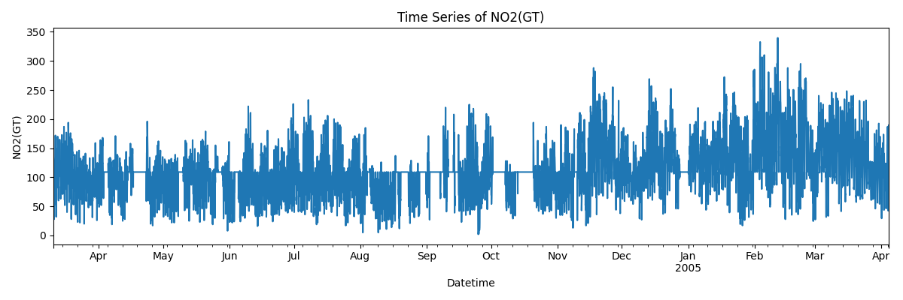 | 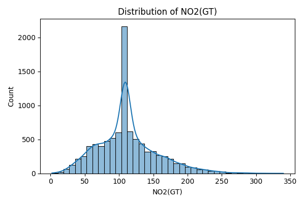 |
| CO               | 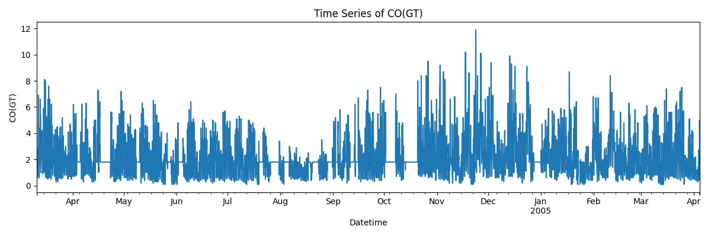  | 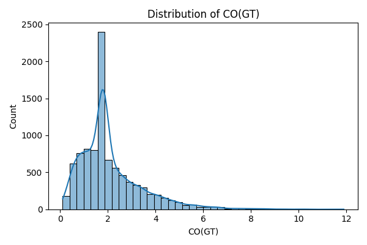  |
| NOx              | 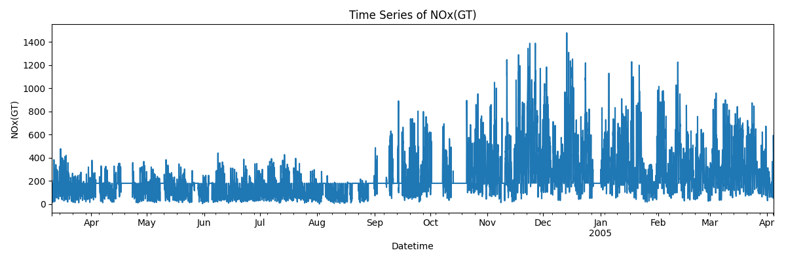 | 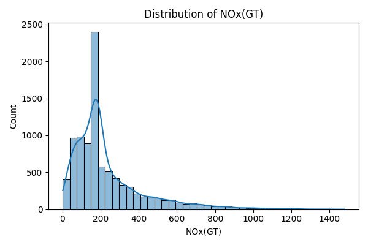 |
| C6H6             | 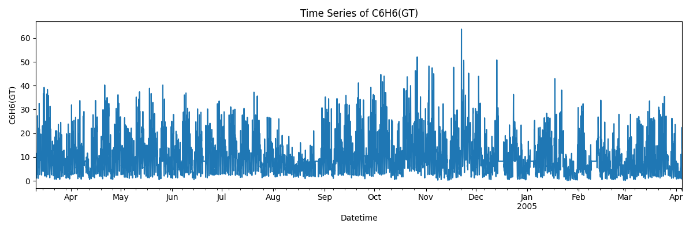 | 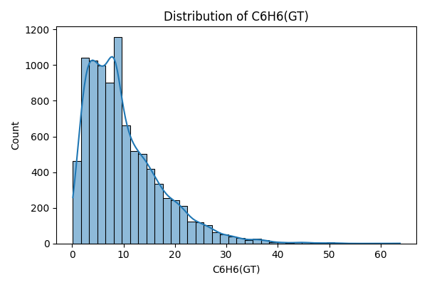 |

### Correlation Matrix

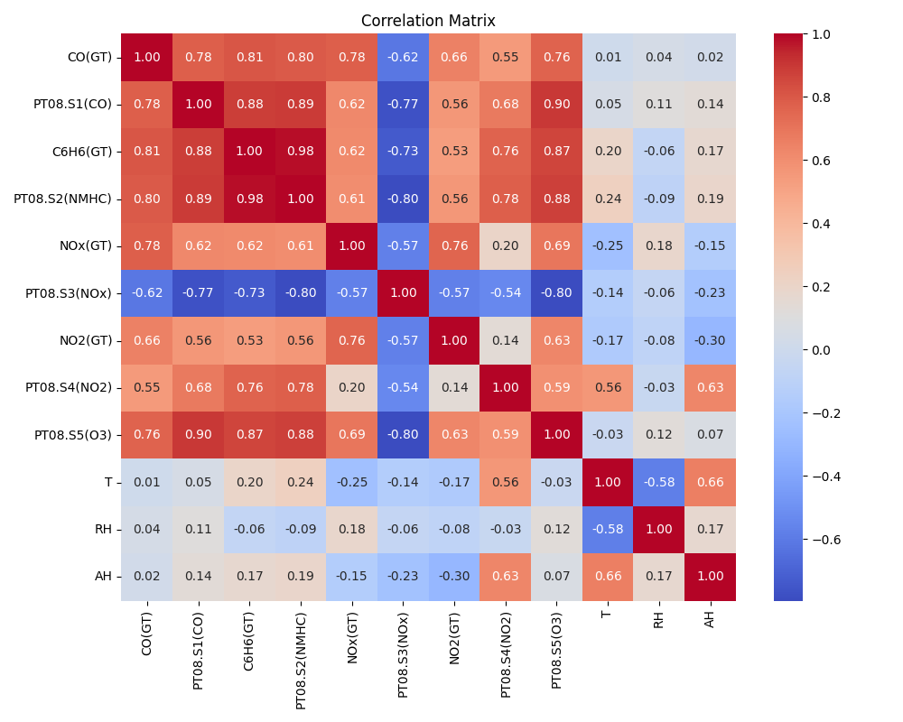

---

## 🔁 Causal Question

**What is the causal effect of NO₂ (NO2(GT)) on Relative Humidity (RH)?**

---

## Causal Graph (DAG)

We model assumed causal dependencies using a Directed Acyclic Graph (DAG):

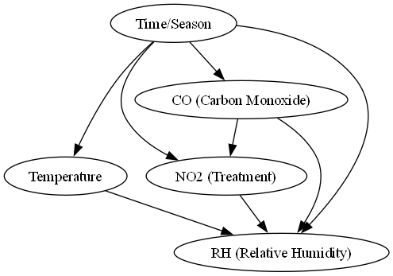

---

## 📈 Estimation and Refutation

Using DoWhy, we estimated the **Average Treatment Effect (ATE)** and validated our findings with a placebo test.

### ➕ Estimated Effect

- **ATE (Average Treatment Effect)** = **-15.83**
- This implies that high NO₂ concentrations cause an estimated **15.83 unit decrease in Relative Humidity (RH)**.

### ❓ Refutation Test

We applied a placebo treatment test to validate the robustness of the estimated effect:

- **Original Effect**: -15.83  
- **Placebo Effect**: -0.04  
- **p-value**: 0.9 (indicating no significant spurious effect)

---

## 📉 Final Visual Result

A clear illustration of the effect:

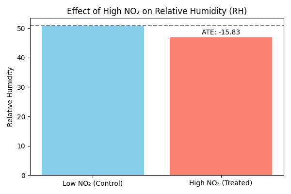

